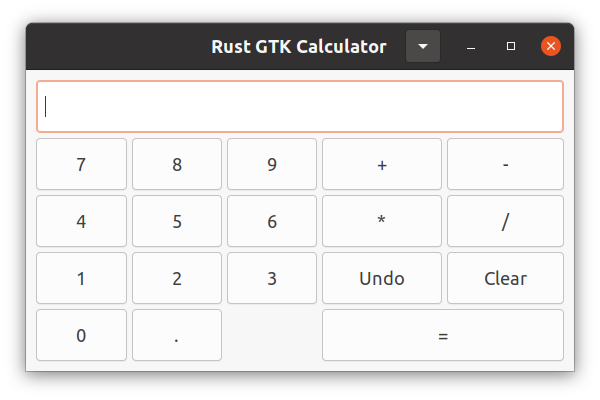

# Rust GTK Calculator

A simple calculator application built with **Rust** and **GTK 3** for the graphical user interface (GUI). This project demonstrates how to use the Rust programming language and GTK 3 to create desktop applications with a clean and user-friendly interface.

---

## Features

- Basic arithmetic operations: addition, subtraction, multiplication, and division.
- A clean and responsive user interface using **GTK Grid**.
- Customizable window size using a configuration file (`config.cfg`).
- Menu button on the title bar with the following actions:
  - Preferences (future implementation)
  - About dialog with program details.

---

## Screenshots

### Calculator Interface



### About Dialog


---

## Requirements

- **Rust** (version `1.80+`)
- **GTK 3** runtime environment
- **Cargo** (Rust's package manager)

---

## Installation and Running

### Step 1: Clone the repository

```bash
git clone https://github.com/haiphamcoder/rust-gtk-calculator.git
cd rust-gtk-calculator
```

### Step 2: Install dependencies

Make sure you have the GTK 3 development libraries installed on your system:

- On **Ubuntu/Debian**:

  ```bash
  sudo apt update
  sudo apt install libgtk-3-dev
  ```

- On **Fedora**:

  ```bash
  sudo dnf install gtk3-devel
  ```

- On **Windows** or **MacOS**, refer to the [GTK Installation Guide](https://gtk.org/docs/installations).

### Step 3: Build and run the project

```bash
cargo build
cargo run
```

---

## Configuration

The application uses a `config.cfg` file to set the default window size. Create or edit the `config.cfg` file in the root directory with the following format:

```cfg
width=400
height=600
```

You can adjust the `width` and `height` values according to your preference.

---

## Project Structure

```text
.
├── src/
│   ├── main.rs          # Entry point of the application
│   ├── config.rs        # Configuration file parser
│   ├── app.rs           # Application logic and UI components
├── config.cfg           # Configuration file for window settings
├── Cargo.toml           # Rust package configuration
├── README.md            # Project documentation
```

---

## Key Files and Modules

- **`src/main.rs`**:
  Initializes and runs the application.
  
- **`src/app.rs`**:
  Contains the core logic of the calculator, menu, and dialog management.

- **`src/config.rs`**:
  Parses the `config.cfg` file to set the default application settings.

---

## Future Improvements

- Add advanced operations (e.g., square root, power, etc.).
- Implement a history panel to show past calculations.
- Add support for saving and loading configurations.
- Improve theme and styling.

---

## Contributing

Contributions are welcome! If you'd like to contribute, please fork the repository and submit a pull request.

### Steps to Contribute

1. Fork the repository.
2. Create a new branch for your feature:

   ```bash
   git checkout -b feature-name
   ```

3. Commit your changes:

   ```bash
   git commit -m "Add your commit message here"
   ```

4. Push your changes and create a pull request:

   ```bash
   git push origin feature-name
   ```

---

## License

This project is licensed under the **MIT License**. See the [LICENSE](./LICENSE) file for more details.

---

## Acknowledgments

- [GTK-rs](https://gtk-rs.org/) for providing bindings to GTK in Rust.
- [Rust Programming Language](https://www.rust-lang.org/) for the robust and safe development experience.
- [Meval](https://crates.io/crates/meval) for evaluating mathematical expressions in Rust.

---

## Contact

If you have any questions or suggestions, feel free to reach out!

- **Email**: <ngochai285nd@gmail.com>
- **GitHub**: [haiphamcoder](https://github.com/haiphamcoder)

---

### Happy coding with Rust and GTK 3! 😊
